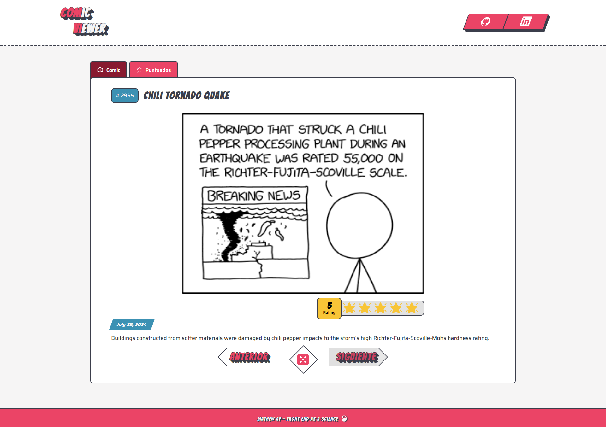
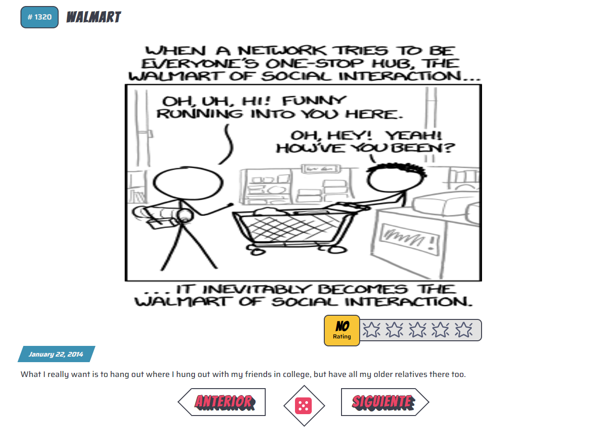
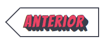
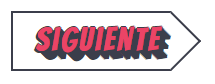
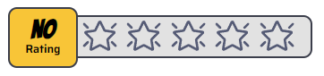
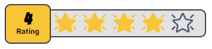

# Trusense Comic Test

## About the project

This project is created to solve a Tech test about a Simple Comic

The URL to access to this project is: [Comic Generator Link](http://comic-generator.com.s3-website-us-east-1.amazonaws.com)

This test was created with the techs:  `[Vue 3, Pinia, SFC's components ]` +  `[7-1 pattern, BEM Methodology]` +  `[Vite, Vitest]` + 

The Cloud Infrastructure in develop in:  `Lambdas, S3, Gateway, CodePipeline`

To manage the information and print the components is used the `Statefull and Stateless pattern`

## How setup the project?

### 1. Install Node:

We need to have installed NodeJs in our devices. It's recommended to have installed `@18+` version, in this case we have the `@20.9`.

Download Node in: [Download Node@20.9](https://nodejs.org/en/blog/release/v20.9.0)

### 2. Close the repositorie

With Github installed, we can clone the repositorie in our device, it's important clone these in a folder to maintain order in our machine.

`git clone https://github.com/MateoAponte/trusense-test.git`

### 3. Install dependencies

The project it's already in our device, now, we gonna install all the dependencies with the command:

`npm i`

### (Optional) 4. Install playwright

To finish the project start-up we have to install the Testing Library _Playwright_, and to do that, only need execute the command:

`npm init playwright@latest`

### 5. Run the project

Vitest provides us a fastly way to run and build project. We can have the functional project in our machine with only the command:

`npm run dev`

`http://localhost:5173/`

## How use the Simple Comic Generator?

The project doesn't have any complex logic to use, only run the project and later go to the url:

[Simple Comic Generator](https://www.comic-generator.online/) (**Important: will always be the same as long as there are no other projects sharing the port.**)

- **Firts render**

When is successfully loaded this one show a random comic, with a title, the hash, an image, a date and some description:

- **Controls**

The project have 3 controls to show the next comic, the previous or show a random comic.

| **Previous Comic**                                                             | **Random Comic**                                                         | **Next Comic**                                                         |
| ------------------------------------------------------------------------------ | ------------------------------------------------------------------------ | ---------------------------------------------------------------------- |
|  |  |  |

- **Rating**

Each comic have a simple system to rating, you can rate clicking a star between 1 or 5 points, and these will be updated with a filled stars

| **Unrated Comic**                                     | **Rated Comic**                                   |
| ----------------------------------------------------- | ------------------------------------------------- |
|  |  |

- **Rated comics**

Each rated comic is saved in a Database, that refresh instantly a a list of all rated comics. Each one have a button to preview the rated comic and delete the rated comic

- **Rated Comics Filters**

The Rated comics have some buttons that allows the possibility to filter by **Rating, Date, Num and Alphabetic**.

## Testing

To check that the project is working properly we can run the testing. In this project have 2 ways to check that.

### Low level test:

Running the follow command execute the unit testing to check the low level test's.

`npm run test:unit`

### High level test:

Running the follow command execute the e2e testing to check the high level test's in real time, in a similar way that the user interacts with our app.

`npm run test:e2e:trace`

## Contribution

To add any change to this project, i recommended follow the next patterns:

### 1. Git:

- Convetional Commits
- Git Trunks

### 2. Styles and HTML:

- BEM Methodology
- 7-1 Pattern

### 3. Components

- SFC'S Components
- Stateless and Statefull components
- Composition API

### 4. Testing

- Vitest to unit testing
- Playwright to E2E Testing (Implementing POM and Fixtures)
- To create new test is recommendable use the **Creation Playwright Tool** using `npm run test:e2e:create`
- Any change added must pass the corresponding tests

### 5. PR's

- It's recommended that all the PR's have a card that describes the content of the PR's, all the new features, updates, fixes.
- It's recommended to have someone to review the code and accept the PR's updating
- All the updates must come from a descriptive branch, if the change goes to main it's necessary test so well, because this will be deployed directly to productive

## Author

    

  
  

## Additional notes

This project is created following the architecture created at the star of the planning:

DNS Propagation Successfully:

  

